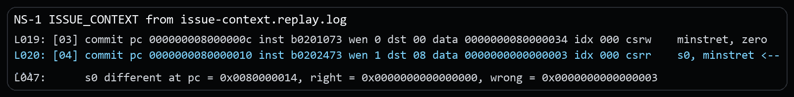
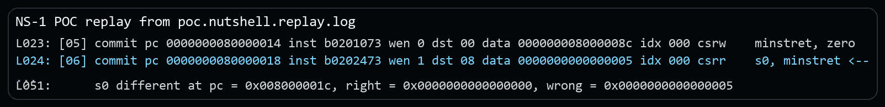
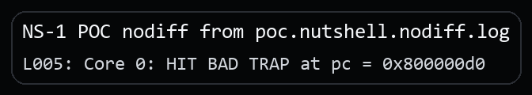

# NutShell `minstret` Reset Visibility Vulnerability Report

## Issue link and affected version

Issue link: `public issue URL will be added after issue publication`

This package is confirmed on the official `release-211228` line at revision `release-211228-142-g041f694` (`041f694965728ea183a0622daa1734002bf4621e`). No local fix revision has been identified yet.

## Candidate title

OSCPU NutShell does not make an architectural `minstret` reset visible to the next read, allowing stale instruction-count state to cross isolation boundaries

## Public issue vs supplementary material

The public issue only states the architectural bug. The security setting, the separate security PoC, and the extra evidence stay in this package.

## Vulnerability type and candidate CWE

**Vulnerability type.** CSR state-update ordering error across a trusted accounting boundary.

**Candidate CWE.** Primary: `CWE-693 Protection Mechanism Failure`. Secondary: `CWE-682 Incorrect Calculation`.

## Core architectural defect

NutShell does not make an explicit write to `minstret` visible to the immediately following CSR read.

The minimal sequence is:

```asm
csrw minstret, zero
csrr s0, minstret
```

In the supplied differential trace, Spike returns `s0 = 0`, while NutShell returns `s0 = 3`. The failing value is the running retired-instruction count, indicating that the automatic retire-count update wins over, or is not correctly arbitrated with, the architectural CSR write.

## RISC-V specification requirement

The key rule for this case is that an explicit CSR write must be the value observed by following instructions. For this sequence, `csrw minstret, zero` must leave `minstret` holding zero, even though the `csrw` instruction itself also retires. The next `csrr s0, minstret` therefore must read zero.

The ratified Zicsr specification, Section **CSR Access Ordering**, provides the underlying rule:

- when a CSR modified implicitly by instruction execution is explicitly written, the explicit write is performed instead of the implicit update;
- a value written to `instret` by one instruction is the value read by the following instruction;
- explicit CSR accesses and their consequences are observed in program order.

Reference: [https://docs.riscv.org/reference/isa/v20260120/unpriv/zicsr.html#_csr_access_ordering](https://docs.riscv.org/reference/isa/v20260120/unpriv/zicsr.html#_csr_access_ordering)

Because `minstret` is the machine-level writable instructions-retired counter, this `instret` ordering rule applies here.

## Issue-level architectural reproduction

The minimal rerun binary for this part is the public issue package's `program.elf`. This CVE package keeps the matching replay excerpt and the key instruction sequence below.

### Steps to reproduce

1. Use the minimal `program.elf` from the public issue package.
2. Run it with NutShell as DUT and Spike as the differential reference.
3. Observe the first five committed instructions, especially the write at `0x8000000c` and read at `0x80000010`.

Core source sequence (trap setup, counter clear, readback, and fail branch):

```asm
la   t0, trap_entry
csrw mtvec, t0
csrw minstret, zero
csrr s0, minstret
bnez s0, fail_minstret_not_cleared
```

### Expected result

The write instruction sets `minstret` to zero and suppresses its own implicit retirement increment. The following `csrr` reads zero, matching Spike.

### Actual result

NutShell reads `3`:

```text
[03] ... csrw minstret, zero
[04] ... csrr s0, minstret ... data 0000000000000003
...
s0 different ... right = 0x0, wrong = 0x3
```

Excerpt from `poc/issue-context.replay.log`:



## Security relevance

The demonstrated security scenario assumes that trusted M-mode firmware uses `minstret` as part of compartment admission, quota enforcement, watchdog logic, or audit measurement.

1. M-mode firmware clears `minstret` before transferring control to a less-privileged compartment.
2. A prior compartment leaves the counter in a nonzero state that should have been discarded by that reset.
3. The monitor immediately samples `minstret` to decide whether a victim compartment may start or continue.
4. NutShell exposes stale state from the previous compartment instead of the fresh baseline.
5. The monitor can deny entry, terminate a victim early, misapply a budget, or record the wrong security measurement.

## Security PoC

### Assumptions

Trusted M-mode firmware uses `minstret` as a compartment-accounting input and expects `csrw minstret, zero` to establish a clean baseline before entering or evaluating a less-privileged workload.

### PoC setup

The proof of concept treats the stale `minstret` value as a trusted admission decision input. Instead of stopping at the raw CSR mismatch, the program makes M-mode use the first post-reset `minstret` sample to decide whether a victim S-mode compartment is allowed to run.

### What the PoC shows

- M-mode clears `minstret` before entering a victim S-mode compartment.
- It immediately samples the fresh baseline.
- If the read is still nonzero, the monitor denies the victim compartment as if stale work from a prior tenant already consumed the budget.

### Security-effect logs

Replay evidence:

```text
[05] ... csrw    minstret, zero
[06] ... data 0000000000000005 ... csrr    s0, minstret <--
...
s0 different ... right = 0x0000000000000000, wrong = 0x0000000000000005
```

Excerpt from `poc.nutshell.replay.log`:



DUT-only security effect:

```text
poc/poc.nutshell.nodiff.log:
Core 0: HIT BAD TRAP at pc = 0x800000d0
```

Excerpt from `poc.nutshell.nodiff.log`:



### Expected architectural result

- expected DUT-only bad-trap PC: `0x800000d0`
- resolved region: `deny_victim_compartment`
- meaning: the monitor denied the victim compartment before entry

### Expected result on NutShell

NutShell returns the stale pre-clear instruction count instead of `0`, and the monitor denies entry to the victim compartment.

### Expected result on a compliant core

The first read after the clear returns `0`, and the victim compartment is entered normally.

## Evidence files

### Issue-level reproduction

- `poc/issue-context.replay.log`: replay log for the minimal architectural mismatch.
- `poc/image/issue-context-actual.png`: screenshot excerpt from the issue-level replay log.

### Security PoC

- `poc/poc.S`: the security PoC source.
- `poc/poc.elf`: the built PoC binary used in the captured runs.
- `poc/poc.nutshell.replay.log`: replay log for the security PoC.
- `poc/poc.nutshell.nodiff.log`: DUT-only log showing the security effect without difftest.
- `poc/image/poc-replay-evidence.png`: screenshot excerpt from the security-PoC replay log.
- `poc/image/poc-nodiff-effect.png`: screenshot excerpt from the DUT-only security-PoC log.

## Primary CIA impact

- Primary: `Availability`. Stale counter state can deny admission or end a victim compartment earlier than policy intended.
- Secondary: `Integrity`. If the same sample is used for attestation, metering, or audit decisions, the trusted record can be wrong.

## Suggested reporting wording

**Recommended framing.** The strongest supported framing is stale machine-counter state crossing a trusted accounting or compartment-admission boundary in machine-mode firmware.

**Suggested description.** OSCPU NutShell on the `release-211228` line, confirmed at `release-211228-142-g041f694`, does not make an architectural CSR write that resets `minstret` visible to the immediately following read of `minstret`. In deployments where machine-mode firmware uses `minstret` to establish instruction-count budgets, compartment-admission baselines, watchdog windows, or audit measurements for less-privileged workloads, stale counter state can cross the protection boundary and cause incorrect security decisions such as denying a victim compartment, prematurely terminating a workload, or recording an incorrect audit or attestation result.

**Suggested supplementary materials.** Include `README.md`, `VULNERABILITY_REPORT.pdf`, `poc/poc.S`, `poc/poc.elf`, the relevant `poc/*.log` evidence, and the screenshots under `poc/image/`.

## Affected version status

Official line: `release-211228`. Confirmed affected revision: `release-211228-142-g041f694` (`041f694965728ea183a0622daa1734002bf4621e`). Fixed: none identified yet. Upstream maintainers have been notified through GitHub, and fix coordination is ongoing.

## Fix direction

The architectural CSR write to `minstret` should take precedence over the same-cycle automatic retire update, or be bypassed so that a following `csrr minstret` observes the older `csrw minstret` result immediately.
