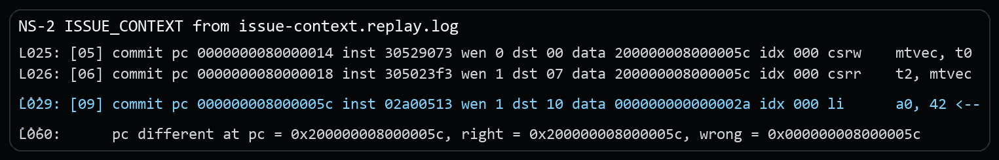
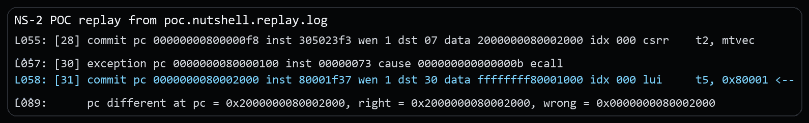
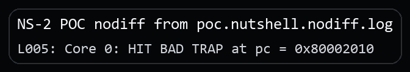

# NutShell `mtvec` Trap-Target Truncation Vulnerability Report

## Issue link and affected version

Issue link: `public issue URL will be added after issue publication`

This package is confirmed on the official `release-211228` line at revision `release-211228-142-g041f694` (`041f694965728ea183a0622daa1734002bf4621e`). No local fix revision has been identified yet.

## Candidate title

OSCPU NutShell preserves upper bits in `mtvec` readback but truncates the actual trap target, enabling low-alias machine-mode redirection on affected SoCs

## Public issue vs supplementary material

The public issue only states the architectural bug. The security setting, the separate security PoC, and the extra evidence stay in this package.

## Vulnerability type and candidate CWE

**Vulnerability type.** Trap-vector address truncation causing machine-mode control-flow redirection.

**Candidate CWE.** Primary: `CWE-197 Numeric Truncation Error`.

## Core architectural defect

NutShell accepts and reads back `mtvec = 0x200000008000005c`, but a subsequent synchronous trap redirects execution to `0x000000008000005c`.

The test writes a high-tagged direct-mode trap vector, verifies that `csrr mtvec` returns the same value, and executes `ecall`. The reference model uses the held XLEN-wide BASE as the trap target; because that address is not fetchable in the test platform, it then reports an instruction access fault at the high address. NutShell instead discards the upper bits and executes the low-address handler (`li a0, 42`).

This report does **not** assume that an implementation must support every possible `mtvec` value. `mtvec` is WARL, so NutShell may legalize unsupported address bits. The bug is the externally visible inconsistency between the value retained/read back by the CSR and the address actually used for trap redirection.

## RISC-V specification requirement

The key requirement is internal consistency. If NutShell reads back `mtvec = 0x200000008000005c`, then that is the trap-vector BASE value software is allowed to observe. A later Direct-mode trap must use that same held BASE, unless the implementation first legalizes the unsupported high bits and exposes the legalized value on readback.

The Machine Privileged Specification defines `mtvec` as an **MXLEN-bit WARL read/write register**. An implementation may restrict the set of values it can hold. However:

- the held BASE value is the trap-vector base;
- in Direct mode, all traps set `pc` to BASE;
- the low two address bits are supplied as zero to form the XLEN-bit address.

Reference: [https://docs.riscv.org/reference/isa/v20260120/priv/machine.html#_machine_trap_vector_base_address_mtvec_register](https://docs.riscv.org/reference/isa/v20260120/priv/machine.html#_machine_trap_vector_base_address_mtvec_register)

A compliant implementation can therefore either legalize unsupported high bits on write (and expose the legalized value on readback), or preserve the held XLEN-wide BASE when generating the trap target. It must not report one held value while silently using a different low alias.

## Issue-level architectural reproduction

The minimal rerun binary for this part is the public issue package's `program.elf`. This CVE package keeps the matching replay excerpt and the key instruction sequence below.

### Steps to reproduce

1. Run the public issue package's `program.elf` under difftest.
2. The program forms `low_trap_entry | 0x2000000000000000`.
3. It writes the result to `mtvec`, reads it back, and executes `ecall` if readback is unchanged.

Core source sequence (high-tagged mtvec formation, readback check, and trap trigger):

```asm
la   t0, low_trap_entry
li   t1, 0x2000000000000000
or   t0, t0, t1
csrw mtvec, t0
csrr t2, mtvec
bne  t2, t0, pass
ecall
```

### Expected result

Either of the following is internally consistent:

1. NutShell legalizes/masks unsupported high BASE bits when writing `mtvec`; `csrr mtvec` returns the legalized value, so the program detects that the original value was not retained; or
2. NutShell retains the full value and uses `0x200000008000005c` as the trap target, allowing the fetch path to execute there or raise the appropriate instruction access fault.

The supplied Spike trace follows the second behavior and reports an instruction access fault (`mcause=1`) at the high target.

### Actual result

NutShell reads back the full high value but jumps to the low alias:

```text
csrw mtvec, t0           data 200000008000005c
csrr t2, mtvec           data 200000008000005c
ecall
commit pc 000000008000005c ... li a0, 42
...
REF pc/mtvec/mepc/mtval = 200000008000005c
DUT pc                  = 000000008000005c
```

Excerpt from `poc/issue-context.replay.log`:



## Security relevance

The demonstrated security scenario assumes systems where the truncated low alias is meaningful and attacker-influenced.

1. M-mode firmware programs `mtvec` to a trusted high address in ROM or secure SRAM.
2. Firmware validates the write by reading `mtvec` back and observing the expected full-width value.
3. The truncated low alias resolves to DRAM, shared SRAM, or another executable region that a lower-privileged attacker can influence.
4. The attacker places instructions at that low alias and then triggers a trap.
5. Machine-mode fetch begins at the attacker-influenced low alias even though software still sees the trusted high address in `mtvec`.

## Security PoC

### Assumptions

Trusted M-mode firmware programs `mtvec` to a high trusted address and relies on readback to validate the setting, while a truncated low alias may be attacker-influenced on an integrated SoC.

### PoC setup

The proof of concept turns the `mtvec` inconsistency into an attacker-influenced control-flow result. The goal is not only to show that readback and trap target differ, but to make the low alias contain a payload prepared by a lower-privileged stage before machine-mode trap entry.

### What the PoC shows

- a lower-privileged S-mode stage copies a small payload into `payload_buf` at the low alias;
- M-mode then programs a high-tagged `mtvec`, validates the high readback, and triggers a trap;
- on NutShell, trap entry begins at the low alias payload prepared by the lower-privileged stage.

### Security-effect logs

Replay evidence:

```text
[28] ... csrr    t2, mtvec
[30] exception pc 0000000080000100 ... ecall
[31] commit pc 0000000080002000 inst 80001f37 ... <--
...
pc different ... right = 0x2000000080002000, wrong = 0x0000000080002000
```

Excerpt from `poc.nutshell.replay.log`:



DUT-only security effect:

```text
poc/poc.nutshell.nodiff.log:
Core 0: HIT BAD TRAP at pc = 0x80002010
```

Excerpt from `poc.nutshell.nodiff.log`:



### Expected architectural result

- expected DUT-only bad-trap PC: `0x80002010`
- resolved region: `payload_buf+0x10`
- meaning: the copied low-alias payload reached its trap terminator after storing the mailbox code to `tohost`

### Expected result on NutShell

NutShell redirects trap control flow to the low alias and executes the payload previously prepared at that low alias, even though software reads back the high `mtvec` value.

### Expected result on a compliant core

Trap redirection uses the same address that software sees in `mtvec`.

## Evidence files

### Issue-level reproduction

- `poc/issue-context.replay.log`: replay log for the minimal architectural mismatch.
- `poc/image/issue-context-actual.png`: screenshot excerpt from the issue-level replay log.

### Security PoC

- `poc/poc.S`: the security PoC source.
- `poc/poc.elf`: the built PoC binary used in the captured runs.
- `poc/poc.nutshell.replay.log`: replay log for the security PoC.
- `poc/poc.nutshell.nodiff.log`: DUT-only log showing the security effect without difftest.
- `poc/image/poc-replay-evidence.png`: screenshot excerpt from the security-PoC replay log.
- `poc/image/poc-nodiff-effect.png`: screenshot excerpt from the DUT-only security-PoC log.

## Primary CIA impact

- Primary: `Integrity`. The bug breaks machine-mode trap-entry control-flow integrity by redirecting execution to attacker-influenced bytes.
- Secondary: `Availability`. If the low alias contains garbage or a crashing payload, the trusted runtime can wedge or abort during trap entry.

## Suggested reporting wording

**Recommended framing.** The strongest supported framing is a readback-based `mtvec` validation bypass that can redirect machine-mode trap entry to a truncated low alias on SoCs where that alias is attacker-influenced.

**Suggested description.** OSCPU NutShell on the `release-211228` line, confirmed at `release-211228-142-g041f694`, can preserve upper address bits in `mtvec` readback while truncating those bits when redirecting to the machine-mode trap handler. On systems where the resulting low alias is writable or otherwise attacker-controlled, a lower-privileged attacker can bypass readback-based `mtvec` validation, prepare instructions at that low alias, and cause machine-mode trap entry to begin at attacker-influenced code despite software observing the intended high trap-vector address in `mtvec`.

**Suggested supplementary materials.** Include `README.md`, `VULNERABILITY_REPORT.pdf`, `poc/poc.S`, `poc/poc.elf`, the relevant `poc/*.log` evidence, and the screenshots under `poc/image/`.

## Affected version status

Official line: `release-211228`. Confirmed affected revision: `release-211228-142-g041f694` (`041f694965728ea183a0622daa1734002bf4621e`). Fixed: none identified yet. Upstream maintainers have been notified through GitHub, and fix coordination is ongoing.

## Fix direction

The value stored in `mtvec`, the value returned by `csrr mtvec`, and the address used for trap-target formation should be made identical, with explicit WARL masking if any address bits are unsupported.
