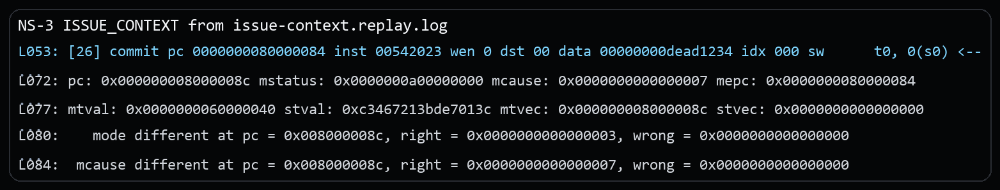
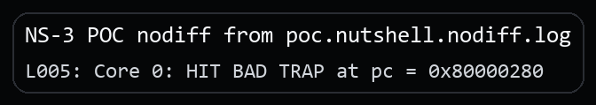

# NutShell Translated Store Access-Fault Suppression Vulnerability Report

## Issue link and affected version

Issue link: `public issue URL will be added after issue publication`

This package is based on the official `release-211228` release tag and was confirmed affected at revision `release-211228-142-g041f694` (`041f694965728ea183a0622daa1734002bf4621e`). No local fix revision has been identified yet.

## Candidate title

OSCPU NutShell may retire translated stores without the required Store/AMO access fault, weakening physical protection boundaries

## Public issue vs supplementary material

The public issue only states the architectural bug. The security setting, the separate security PoC, and the extra evidence stay in this package.

## Vulnerability type and candidate CWE

**Vulnerability type.** Translated data-access fault enforcement failure at a physical protection boundary.

**Candidate CWE.** Primary: `CWE-284 Improper Access Control`. Secondary: `CWE-693 Protection Mechanism Failure`.

## Core architectural defect

A U-mode `sw` passes Sv39 page permission checks but translates to a physical-address hole. Spike takes a precise Store/AMO access fault (`mcause=7`) at the store. NutShell commits the store, remains in U-mode, and does not update `mcause`, `mepc`, or `mtval`.

The root-level leaf PTE maps virtual address `0x60000040` through a 1 GiB Sv39 superpage. Although the PTE's explicit PPN is zero, Sv39 copies the lower VPN fields into the physical PPN for a superpage, so the resulting physical address is **`0x20000040`**, not `0x40`.

In the supplied platform configuration that address is outside the RAM/flash/MMIO map and the reference model reports an access fault.

## RISC-V specification requirement

The important point is that passing page permission checks is not enough. Sv39 first computes a physical address, and the actual physical memory access can still fail. In this test, the 1 GiB superpage rule makes `0x60000040` translate to physical address `0x20000040`; because that physical address is outside the platform's accessible map, the store must raise a Store/AMO access fault instead of retiring.

The Supervisor Privileged Specification defines the Sv39 translation algorithm. For a superpage, the lower physical PPN components are copied from the virtual VPN components. After translation, the resulting physical access is still subject to the platform's PMA/PMP and access-error behavior.

Relevant translation rule:

- `pa.pgoff = va.pgoff`;
- for `i > 0`, `pa.ppn[i-1:0] = va.vpn[i-1:0]`;
- remaining physical PPN bits come from the leaf PTE.

Reference: [https://docs.riscv.org/reference/isa/v20260120/priv/supervisor.html#_virtual_address_translation_process](https://docs.riscv.org/reference/isa/v20260120/priv/supervisor.html#_virtual_address_translation_process)

When a store cannot be completed because the resulting physical address fails the platform's access checks, the architectural exception is Store/AMO access fault (cause 7), and the store must not retire as a successful architectural memory operation.

## Issue-level architectural reproduction

The minimal rerun binary for this part is the public issue package's `program.elf`. This CVE package keeps the matching replay excerpt and the key instruction sequence below.

### Steps to reproduce

1. Run the public issue package's `program.elf`.
2. M-mode installs two root-level Sv39 leaf entries: executable U-mode code at `0x80000000` and writable U-mode test VA `0x60000040`.
3. M-mode clears MPP and executes `mret` into U-mode.
4. U-mode executes `sw 0xdead1234, 0(0x60000040)`.

Core source sequence (Sv39 enable, privilege drop, and faulting U-mode store):

```asm
la   t0, root_pt
srli t0, t0, 12
li   t1, SATP_MODE_SV39
slli t1, t1, 60
or   t0, t0, t1
csrw satp, t0
sfence.vma x0, x0

li   t0, MSTATUS_MPP_MASK
csrc mstatus, t0
la   t0, u_store
csrw mepc, t0
mret

u_store:
li   s0, 0x60000040
li   t0, 0xdead1234
sw   t0, 0(s0)
ecall
```

### Expected result

A precise Store/AMO access fault:

- `mcause = 7`
- `mepc = address of sw` (`0x80000084` in this build)
- `mtval = 0x60000040`
- current privilege becomes M-mode because delegation is cleared
- the store has no architectural side effect

### Actual result

NutShell shows the store as committed and remains in U-mode, while Spike has entered the M-mode handler:

```text
DUT: [26] commit ... sw t0, 0(s0)
REF: mcause=7, mepc=0x80000084, mtval=0x60000040, privilege=3
DUT: mcause=0, mtval=0, privilege=0
```

Excerpt from `poc/issue-context.replay.log`:



## Security relevance

The demonstrated security scenario assumes deployments where translated accesses are expected to stop at a real physical protection boundary such as PMP, PMA, or a protected MMIO aperture.

1. Trusted M-mode software treats a physical page or device region as protected from lower-privileged stores.
2. An untrusted page-table owner maps a user VA to that protected physical destination.
3. The lower-privileged context performs an ordinary translated store.
4. NutShell suppresses the required precise Store/AMO access fault.
5. If the denied write is not cancelled, protected state can be modified or a protected MMIO side effect can be triggered.

## Security PoC

### Assumptions

M-mode protects a physical destination behind a machine-controlled physical protection boundary, while a lower-privileged context controls a translated virtual mapping that points to that destination.

### PoC setup

The proof of concept treats the translated store as a real write into a protected physical page instead of stopping at the missing architectural exception. The program arranges a lower-privileged translated store to target a protected canary and then checks in M-mode whether the protected value changed.

### What the PoC shows

- The PoC assembly maps a U-mode store onto a protected physical canary page.
- If the translated store returns, M-mode reads the protected physical location back.
- The program enters the fail path only when the protected canary equals the attacker value.

### Security-effect logs

DUT-only security effect:

```text
poc/poc.nutshell.nodiff.log:
Core 0: HIT BAD TRAP at pc = 0x80000280
```

Excerpt from `poc.nutshell.nodiff.log`:



### Expected architectural result

- expected DUT-only bad-trap PC: `0x80000280`
- resolved region: `fail_protected_write_committed`
- meaning: the protected physical canary matched `NEW_VALUE` after the translated store returned

### Expected result on NutShell

The DUT-only run reaches `fail_protected_write_committed`, recorded as `HIT BAD TRAP at pc = 0x80000280`, which means the protected physical canary matched the attacker value after the store returned.

### Expected result on a compliant core

The translated store raises `Store/AMO access fault` with precise `mepc` and `mtval`, and the protected physical canary remains unchanged.

## Evidence files

### Issue-level reproduction

- `poc/issue-context.replay.log`: replay log for the minimal architectural mismatch.
- `poc/image/issue-context-actual.png`: screenshot excerpt from the issue-level replay log.

### Security PoC

- `poc/poc.S`: the security PoC source.
- `poc/poc.elf`: the built PoC binary used in the captured runs.
- `poc/poc.nutshell.nodiff.log`: DUT-only log showing the security effect without difftest.
- `poc/image/poc-nodiff-effect.png`: screenshot excerpt from the DUT-only security-PoC log.

## Primary CIA impact

- Primary: `Integrity`. A lower-privileged translated store can modify data that trusted software expected a physical protection boundary to block.
- Secondary: `Availability`. If the destination is control state or MMIO, the same primitive can trigger destructive side effects or crash the system.

## Suggested reporting wording

**Recommended framing.** The strongest supported framing is suppression of a required translated-store access fault, weakening a machine-enforced physical protection boundary.

**Suggested description.** OSCPU NutShell, based on the official `release-211228` release tag and confirmed affected at `release-211228-142-g041f694`, may allow a translated store from a lower-privileged context to retire without the required Store/AMO access fault when the translated physical destination is not writable. In systems that rely on PMP, PMA, or a protected MMIO boundary, this can weaken machine-enforced physical protection and may allow integrity or availability impact if the denied write is not cancelled downstream. The supplied package includes a DUT-only self-oracle showing that a protected physical canary changed after the retired store.

**Suggested supplementary materials.** Include `README.md`, `VULNERABILITY_REPORT.pdf`, `poc/poc.S`, `poc/poc.elf`, the relevant `poc/*.log` evidence, and the screenshots under `poc/image/`.

## Affected version status

Official release tag: `release-211228`. Confirmed affected revision: `release-211228-142-g041f694` (`041f694965728ea183a0622daa1734002bf4621e`). Fixed: none identified yet. Upstream maintainers have been notified through GitHub, and fix coordination is ongoing.

## Fix direction

Translated store access failures should be reported distinctly from page faults and misaligned faults, and the store side effect should be cancelled before any memory or device state becomes visible.
