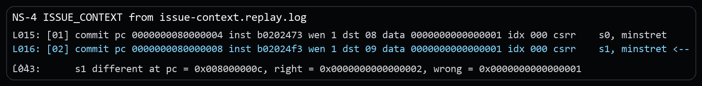
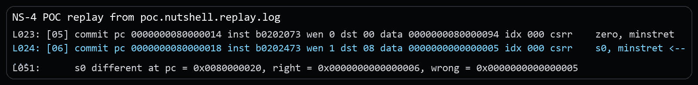
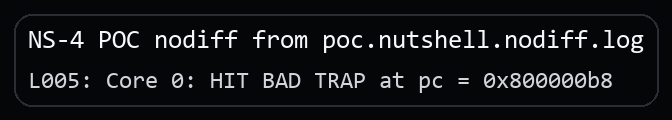

# NutShell One-Instruction-Stale `minstret` Visibility Vulnerability Report

## Issue link and affected version

Issue link: `public issue URL will be added after issue publication`

This package is confirmed on the official `release-211228` line at revision `release-211228-142-g041f694` (`041f694965728ea183a0622daa1734002bf4621e`). No local fix revision has been identified yet.

## Candidate title

OSCPU NutShell may expose a one-instruction-stale `minstret` value at live policy checks, enabling off-by-one boundary mis-accounting

## Public issue vs supplementary material

The public issue only states the architectural bug. The security setting, the separate security PoC, and the extra evidence stay in this package.

## Vulnerability type and candidate CWE

**Vulnerability type.** CSR visibility lag at a live boundary check.

**Candidate CWE.** Primary: `CWE-693 Protection Mechanism Failure`. Secondary: `CWE-682 Incorrect Calculation`.

## Core architectural defect

NutShell returns a `minstret` value that omits the immediately preceding retired instruction. In the shortest self-contained reproducer, a warm-up read of `minstret` is followed by two visible reads. Architecturally, those two visible reads should differ by one because the first visible CSR read retires normally. Spike returns `s0=1`, `s1=2`; NutShell returns `s0=1`, `s1=1`.

```asm
csrr zero, minstret
csrr s0, minstret
csrr s1, minstret
```

This avoids depending on reset value or a software write to `minstret`. It isolates next-instruction visibility of the retired-instruction count.

Additional control experiments show that the issue is broader than a preceding `csrr minstret`. Replacing the immediately preceding instruction with `nop` or `csrr mcycle` still produces the same off-by-one mismatch (`right = 6`, `wrong = 5`), and inserting an extra retired instruction shifts the mismatch to `right = 7`, `wrong = 6`. The observed behavior is therefore that `csrr minstret` exposes a count that generally lags one retired instruction behind the architectural value.

## RISC-V specification requirement

Zicsr states that a CSR read observes the value before that instruction executes, and CSR state changes are observed in program order by subsequent instructions. `minstret` counts retired instructions, so a `csrr minstret` must observe all architecturally older retired instructions while excluding only its own retirement. Therefore the value read by `csrr minstret` must already include the retirement of the immediately preceding instruction, whether that preceding instruction is another CSR read or an unrelated retired instruction.

Reference: [https://docs.riscv.org/reference/isa/v20260120/unpriv/zicsr.html#_csr_access_ordering](https://docs.riscv.org/reference/isa/v20260120/unpriv/zicsr.html#_csr_access_ordering)

## Issue-level architectural reproduction

The minimal rerun binary for this part is the public issue package's `program.elf`. This CVE package keeps the matching replay excerpt and the key instruction sequence below.

### Steps to reproduce

Run the public issue package's `program.elf` under difftest. Compare the two visible reads at PCs `0x80000004` and `0x80000008`. This is the minimal reproducer; control experiments with `nop` and `csrr mcycle` before `csrr minstret` show the same one-instruction lag.

Core source sequence (warm-up read, two visible reads, and delta check):

```asm
csrr zero, minstret
csrr s0, minstret
csrr s1, minstret
sub  t0, s1, s0
li   t1, 1
bne  t0, t1, fail_bad_delta
```

### Expected result

`(s1 - s0) == 1`; in the supplied reference trace, `s0=1`, `s1=2`. More generally, a `csrr minstret` should include the retirement of the immediately preceding instruction.

### Actual result

NutShell returns `s0=1`, `s1=1` in the minimal reproducer:

```text
[01] csrr s0, minstret ... data 1
[02] csrr s1, minstret ... data 1
REF s0=1 s1=2
s1 different ... right=2, wrong=1
```

Control experiments show the same lag with other preceding instructions:

- preceding `nop` then `csrr minstret`: `right = 6`, `wrong = 5`
- preceding `csrr mcycle` then `csrr minstret`: `right = 6`, `wrong = 5`
- one additional retired instruction before the read: `right = 7`, `wrong = 6`

Excerpt from `poc/issue-context.replay.log`:



## Security relevance

The demonstrated security scenario assumes a trusted monitor that uses an exact live `minstret` sample to open or close a one-shot execution or service window.

1. M-mode firmware lets an untrusted compartment run until a strict instruction threshold.
2. The monitor performs an audit read and then immediately samples `minstret` to decide whether the guarded window is still open.
3. NutShell returns a stale count that is one instruction behind the architectural value.
4. The stale value makes the monitor believe the threshold has not yet been crossed.
5. The monitor grants one extra monitor-mediated action or leaves the window open one instruction longer than intended.

## Security PoC

### Assumptions

Trusted firmware uses an exact live `minstret` reading as a threshold gate for a security-relevant decision such as quota enforcement or a one-shot monitor service.

### PoC setup

The proof of concept makes the stale back-to-back `minstret` read control a one-shot service gate. The program uses the next visible `minstret` sample as the authoritative live count and grants an extra S-mode service only when that count is still inside the allowed window.

### What the PoC shows

- the monitor performs one audit read into `x0`;
- it treats the next visible `minstret` sample as the live authoritative count;
- if that sample is still within a tiny service window, the monitor would grant one extra less-privileged service.

### Security-effect logs

Replay evidence:

```text
[05] ... csrr    zero, minstret
[06] ... data 0000000000000005 ... csrr    s0, minstret <--
...
s0 different ... right = 0x0000000000000006, wrong = 0x0000000000000005
```

Excerpt from `poc.nutshell.replay.log`:



DUT-only security effect:

```text
poc/poc.nutshell.nodiff.log:
Core 0: HIT BAD TRAP at pc = 0x800000b8
```

Excerpt from `poc.nutshell.nodiff.log`:



### Expected architectural result

- expected DUT-only bad-trap PC: `0x800000b8`
- resolved region: `m_trap` success path
- meaning: the extra S-mode service was granted and returned through the success path

### Expected result on NutShell

NutShell undercounts the authoritative live sample, keeps the service window open longer than intended, and grants the extra less-privileged service path.

### Expected result on a compliant core

The authoritative live sample reflects the preceding audit read, so the extra service window closes on time.

## Evidence files

### Issue-level reproduction

- `poc/issue-context.replay.log`: replay log for the minimal architectural mismatch.
- `poc/image/issue-context-actual.png`: screenshot excerpt from the issue-level replay log.

### Security PoC

- `poc/poc.S`: the security PoC source.
- `poc/poc.elf`: the built PoC binary used in the captured runs.
- `poc/poc.nutshell.replay.log`: replay log for the security PoC.
- `poc/poc.nutshell.nodiff.log`: DUT-only log showing the security effect without difftest.
- `poc/image/poc-replay-evidence.png`: screenshot excerpt from the security-PoC replay log.
- `poc/image/poc-nodiff-effect.png`: screenshot excerpt from the DUT-only security-PoC log.

## Primary CIA impact

- Primary: `Availability`. The stale authoritative sample can keep a one-shot window open and grant an extra action beyond policy.
- Secondary: `Integrity`. If the same threshold is used for audit or quota enforcement, the trusted accounting result is wrong by one retired instruction.

## Suggested reporting wording

**Recommended framing.** The strongest supported framing is stale counter visibility on a live policy sample, allowing a monitor-controlled service or execution window to remain open too long.

**Suggested description.** OSCPU NutShell on the `release-211228` line, confirmed at `release-211228-142-g041f694`, may return a `minstret` value that is one retired instruction behind the architectural count at a live policy sample, including representative cases where firmware samples `minstret` immediately after another retired instruction. In systems where machine-mode firmware relies on exact `minstret` boundaries to enforce execution quotas, service windows, or audit steps for less-privileged workloads, this off-by-one visibility error can cause incorrect security decisions and may keep a monitor-controlled service window open one instruction longer than intended.

**Suggested supplementary materials.** Include `README.md`, `VULNERABILITY_REPORT.pdf`, `poc/poc.S`, `poc/poc.elf`, the relevant `poc/*.log` evidence, and the screenshots under `poc/image/`.

## Affected version status

Official line: `release-211228`. Confirmed affected revision: `release-211228-142-g041f694` (`041f694965728ea183a0622daa1734002bf4621e`). Fixed: none identified yet. Upstream maintainers have been notified through GitHub, and fix coordination is ongoing.

## Fix direction

A `csrr minstret` should observe all architecturally older retired instructions while excluding its own retirement, so consecutive reads expose the same state progression that the reference model exposes.
