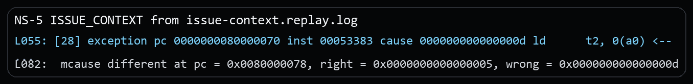
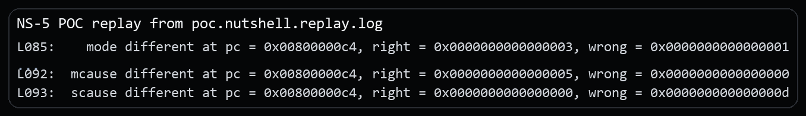
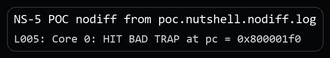

# NutShell PTW Access-Fault Misclassification Vulnerability Report

## Issue link and affected version

Issue link: `public issue URL will be added after issue publication`

This package is confirmed on the official `release-211228` line at revision `release-211228-142-g041f694` (`041f694965728ea183a0622daa1734002bf4621e`). No local fix revision has been identified yet.

## Candidate title

OSCPU NutShell misclassifies page-table-walk access faults as page faults, which can reroute traps away from machine-mode policy

## Public issue vs supplementary material

The public issue only states the architectural bug. The security setting, the separate security PoC, and the extra evidence stay in this package.

## Vulnerability type and candidate CWE

**Vulnerability type.** Exception classification error at the trap-delegation boundary.

**Candidate CWE.** Primary: `CWE-755 Improper Handling of Exceptional Conditions`. Secondary: `CWE-693 Protection Mechanism Failure`.

## Core architectural defect

During an Sv39 load translation, the root PTE is a valid non-leaf PTE whose PPN points to physical page 0. Accessing the next-level PTE therefore fails the platform's physical access checks.

Spike reports a **Load access fault** (`mcause=5`). NutShell reports a **Load page fault** (`mcause=13`). The original PTE content is not the reason for failure: the implicit memory access needed to fetch that PTE cannot be performed. These two conditions have different architectural causes and, importantly, may have different trap-delegation policy.

## RISC-V specification requirement

The distinction here is between failing to read a PTE and reading a bad PTE. If the page-table walker cannot access the memory containing the next PTE, the fault is an access fault for the original operation. It only becomes a page fault after the PTE has actually been read and its contents are found to be invalid or reserved.

The Supervisor Privileged Specification's virtual-address translation algorithm is explicit:

- Step 2 accesses the PTE at the computed physical address.
- If accessing that PTE violates a PMA or PMP check, the implementation raises an **access-fault exception corresponding to the original access type**.
- Only after a PTE is successfully read does an invalid/reserved PTE encoding cause a corresponding **page-fault exception**.

Reference: [https://docs.riscv.org/reference/isa/v20260120/priv/supervisor.html#_virtual_address_translation_process](https://docs.riscv.org/reference/isa/v20260120/priv/supervisor.html#_virtual_address_translation_process)

For this original load, a failed implicit PTE read must therefore be cause 5, not cause 13.

## Issue-level architectural reproduction

The minimal rerun binary for this part is the public issue package's `program.elf`. This CVE package keeps the matching replay excerpt and the key instruction sequence below.

### Steps to reproduce

1. Run the public issue package's `program.elf` under difftest.
2. The test writes a valid non-leaf root PTE with `PPN=0` for virtual address `0x40201010`.
3. It enables Sv39 and uses S-mode effective privilege for the data access.
4. It executes `ld t2, 0(0x40201010)`.

Core source sequence (root non-leaf install, Sv39 enable, S-mode effective access, and faulting load):

```asm
/* root_pt[ROOT_INDEX] = PTE_V, PPN = 0 */
la   t0, root_pt
li   t1, PTE_V
sd   t1, (ROOT_INDEX * 8)(t0)

la   t0, root_pt
srli t0, t0, 12
li   t1, SATP_SV39
or   t0, t0, t1
csrw satp, t0
sfence.vma x0, x0

li   t0, MSTATUS_MPP_MASK
csrc mstatus, t0
li   t0, MSTATUS_MPP_S
csrs mstatus, t0
li   t0, MSTATUS_MPRV
csrs mstatus, t0

li   a0, MY_VA
ld   t2, 0(a0)
```

### Expected result

- `mcause = 5` (Load access fault)
- `mepc = load_site`
- `mtval = 0x40201010`

### Actual result

NutShell labels the fault as cause 13, while Spike reports cause 5:

```text
DUT exception ... cause 000000000000000d ld t2, 0(a0)
REF mcause=0000000000000005 mepc=0000000080000070
REF mtval=0000000040201010
mcause different ... right=5, wrong=d
```

Excerpt from `poc/issue-context.replay.log`:



## Security relevance

The demonstrated security scenario assumes systems where M-mode uses `medeleg` to distinguish ordinary guest page faults from forbidden physical page-table accesses.

1. M-mode delegates load page faults with `medeleg[13] = 1`.
2. M-mode intentionally retains load access faults with `medeleg[5] = 0` so the monitor can audit or terminate forbidden page-table walks.
3. An untrusted S-mode payload points a non-leaf PTE at a PMP- or PMA-denied physical page.
4. The page-table walker hits a physical access failure.
5. NutShell reports cause `13` instead of cause `5`, so the event is routed to S-mode instead of the intended M-mode monitor.

## Security PoC

### Assumptions

M-mode delegates ordinary page faults to S-mode but retains access faults for security monitoring, while S-mode is allowed to control or influence its page tables.

### PoC setup

The proof of concept turns the PTW cause-classification bug into a concrete trap-routing mistake. The program deliberately gives page faults and access faults different handling policies so that the wrong cause value changes which privilege level receives the event.

### What the PoC shows

- Spike/reference keeps the PTW failure in M-mode as `Load access fault`.
- NutShell misclassifies the same PTW failure as `Load page fault`.
- Because `medeleg[13]` is set while `medeleg[5]` is left clear, the wrong classification routes the event into the S-mode handler instead of the M-mode monitor.

### Security-effect logs

Replay evidence:

```text
mode different ... right = 0x0000000000000003, wrong = 0x0000000000000001
sepc different ... right = 0x0000000000000000, wrong = 0x00000000800000bc
mcause different ... right = 0x0000000000000005, wrong = 0x0000000000000000
scause different ... right = 0x0000000000000000, wrong = 0x000000000000000d
```

Excerpt from `poc.nutshell.replay.log`:



DUT-only security effect:

```text
poc/poc.nutshell.nodiff.log:
Core 0: HIT BAD TRAP at pc = 0x800001f0
```

Excerpt from `poc.nutshell.nodiff.log`:



### Expected architectural result

- expected DUT-only bad-trap PC: `0x800001f0`
- resolved region: `s_trap` delegated success path
- meaning: the PTW event was routed into the delegated S-mode handler

### Expected result on NutShell

NutShell routes the PTW event into the delegated S-mode trap path, even though the same access should have remained a retained M-mode access fault.

### Expected result on a compliant core

The access failure during the page-table walk is surfaced as `Load access fault` in M-mode, with no S-mode delegation.

## Evidence files

### Issue-level reproduction

- `poc/issue-context.replay.log`: replay log for the minimal architectural mismatch.
- `poc/image/issue-context-actual.png`: screenshot excerpt from the issue-level replay log.

### Security PoC

- `poc/poc.S`: the security PoC source.
- `poc/poc.elf`: the built PoC binary used in the captured runs.
- `poc/poc.nutshell.replay.log`: replay log for the security PoC.
- `poc/poc.nutshell.nodiff.log`: DUT-only log showing the security effect without difftest.
- `poc/image/poc-replay-evidence.png`: screenshot excerpt from the security-PoC replay log.
- `poc/image/poc-nodiff-effect.png`: screenshot excerpt from the DUT-only security-PoC log.

## Primary CIA impact

- Primary: `Integrity`. The bug breaks trap-routing and monitor-policy integrity by reclassifying an event that should stay in M-mode.
- Secondary: `Availability`. Misrouting a forbidden PTW access can disable the intended terminate-or-audit response and destabilize isolation policy.

## Suggested reporting wording

**Recommended framing.** The strongest supported framing is PTW fault misclassification that bypasses a machine-mode monitoring policy by rerouting the trap through `medeleg`.

**Suggested description.** OSCPU NutShell on the `release-211228` line, confirmed at `release-211228-142-g041f694`, may report a page-table-walk access failure as a page fault rather than the required access fault for the original memory operation. In systems where machine-mode firmware delegates page faults to S-mode but retains access faults for security monitoring, an untrusted S-mode payload can cause a forbidden page-table walk to be routed away from the machine-mode monitor and into the delegated S-mode path, bypassing audit or termination policy.

**Suggested supplementary materials.** Include `README.md`, `VULNERABILITY_REPORT.pdf`, `poc/poc.S`, `poc/poc.elf`, the relevant `poc/*.log` evidence, and the screenshots under `poc/image/`.

## Affected version status

Official line: `release-211228`. Confirmed affected revision: `release-211228-142-g041f694` (`041f694965728ea183a0622daa1734002bf4621e`). Fixed: none identified yet. Upstream maintainers have been notified through GitHub, and fix coordination is ongoing.

## Fix direction

PTW memory-access failures should remain distinguishable from PTE-validity and permission page faults, preserve the original access type, and reach trap routing as causes `1`, `5`, or `7` before any page-fault delegation logic applies.
