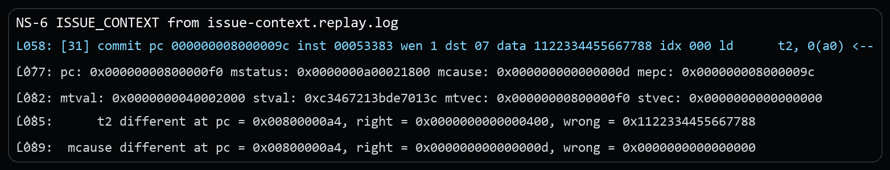
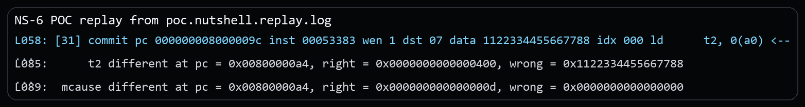
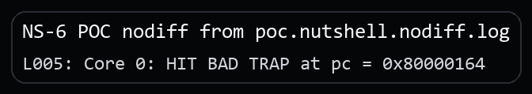

# NutShell Misaligned Sv39 Gigapage Acceptance Vulnerability Report

## Issue link and affected version

Issue link: `https://github.com/OSCPU/NutShell/issues/265`

This package is based on the official `release-211228` release tag and was confirmed affected at revision `release-211228-142-g041f694` (`041f694965728ea183a0622daa1734002bf4621e`). No local fix revision has been identified yet.

## Candidate title

OSCPU NutShell accepts misaligned Sv39 1 GiB leaf PTEs and resolves invalid physical aliases instead of raising a load page fault

## Public issue vs supplementary material

The public issue only states the architectural bug. The security setting, the separate security PoC, and the extra evidence stay in this package.

## Vulnerability type and candidate CWE

**Vulnerability type.** Page-table metadata validation failure.

**Candidate CWE.** Primary: `CWE-20 Improper Input Validation`.

## Core architectural defect

NutShell accepts a root-level Sv39 leaf PTE for a 1 GiB mapping even when the lower PPN fields are nonzero. A compliant implementation must treat this as a misaligned superpage and raise a page-fault exception corresponding to the original access type.

In the supplied PoC, the test intentionally sets PTE bit 10 (PPN[0] bit 0) in a root-level leaf and then constructs virtual address `0x40002000` so that the malformed 1 GiB mapping aliases a physical canary at `bad_data`. Spike raises a precise Load page fault (`mcause=13`), while NutShell completes the load and returns `0x1122334455667788`.

## RISC-V specification requirement

The Sv39 virtual-address translation algorithm is explicit: after a leaf PTE is found, if the current level represents a superpage and the lower PPN fields are not all zero, the implementation must raise a page-fault exception corresponding to the original access type.

Reference: [https://docs.riscv.org/reference/isa/v20260120/priv/supervisor.html#_virtual_address_translation_process](https://docs.riscv.org/reference/isa/v20260120/priv/supervisor.html#_virtual_address_translation_process)

Because the original access in this PoC is a load, the required architectural exception is Load page fault (`mcause=13`), not successful completion of the load.

## Issue-level architectural reproduction

The minimal rerun binary for this part is the public issue package's `program.elf`. This CVE package keeps the matching replay excerpt and the key instruction sequence below.

### Steps to reproduce

1. Run the public issue package's `program.elf` under difftest.
2. M-mode installs a root-level Sv39 leaf in `root_pt[1]` and deliberately sets a nonzero lower PPN bit, making the 1 GiB superpage leaf misaligned.
3. The test enables Sv39 with S-mode effective privilege, constructs a VA whose low 30 bits alias `bad_data`, and executes the faulting load.

Core source sequence (malformed gigapage leaf, Sv39 enable, crafted VA, and faulting load):

```asm
/* root_pt[1] is a malformed 1 GiB leaf: PPN[0] bit 0 is forced to 1. */
la   t0, root_pt
la   t1, bad_data
srli t1, t1, 12
slli t1, t1, 10
ori  t1, t1, PTE_RAD
li   t2, (1 << 10)
or   t1, t1, t2
sd   t1, 8(t0)

la   t0, root_pt
srli t0, t0, 12
li   t1, SATP_SV39
or   t0, t0, t1
csrw satp, t0
sfence.vma x0, x0

li   t0, MSTATUS_MPP_MASK
csrc mstatus, t0
li   t0, MSTATUS_MPP_S
csrs mstatus, t0
li   t0, MSTATUS_MPRV
csrs mstatus, t0

/* Build a VPN[2]=1 VA whose low 30 bits alias bad_data. */
la   t0, bad_data
li   t1, 0x3fffffff
and  a0, t0, t1
li   t1, 0x40000000
or   a0, a0, t1
ld   t2, 0(a0)
```

### Expected result

- The load does not complete.
- `mcause = 13` (Load page fault).
- `mepc = load_site` (`0x8000009c` in this build).
- `mtval = 0x40002000`.
- The destination register does not receive the canary value through the malformed mapping.

### Actual result

NutShell commits the load and exposes the canary value, while Spike takes the page fault:

```text
[31] commit pc 000000008000009c ... data 1122334455667788 ... ld      t2, 0(a0) <--
pc: 0x00000000800000f0 ... mcause: 0x000000000000000d mepc: 0x000000008000009c
mtval: 0x0000000040002000 ...
t2 different ... right = 0x0000000000000400, wrong = 0x1122334455667788
mtval different ... right = 0x0000000040002000, wrong = 0x0000000000000000
mcause different ... right = 0x000000000000000d, wrong = 0x0000000000000000
```

Excerpt from `poc/issue-context.replay.log`:



## Security relevance

The demonstrated security scenario assumes a trust model where page-table construction crosses a boundary and the trusted side expects only architecturally valid 1 GiB leaves to resolve.

1. A trusted runtime authorizes or audits only aligned 1 GiB mappings.
2. An untrusted guest or page-table owner presents a malformed root-level leaf with nonzero lower PPN fields.
3. A compliant core would reject that entry and raise a page fault.
4. NutShell resolves the malformed gigapage anyway and forms an unintended physical alias.
5. The attacker can disclose physical data outside the aligned region the trusted runtime believed it was exposing.

## Security PoC

### Assumptions

A lower-privileged page-table owner is expected to stay within architecturally valid gigapage mappings, while trusted software assumes malformed superpage leaves will fault instead of resolve.

### PoC setup

The proof of concept uses the malformed gigapage leaf as a self-oracle for disclosure. Instead of only checking whether a page fault is missing, the program arranges for the invalid alias to point at a physical canary and treats a successful canary read as the security effect.

### What the PoC shows

- The root-level leaf is made physically misaligned by forcing nonzero lower PPN bits.
- The virtual address is chosen so the invalid 1 GiB alias resolves to `bad_data`.
- The program enters the fail path only when the load returns the physical canary.

### Security-effect logs

Replay evidence:

```text
[31] ... data 1122334455667788 ... ld      t2, 0(a0) <--
...
mcause different ... right = 0x000000000000000d, wrong = 0x0000000000000000
```

Excerpt from `poc.nutshell.replay.log`:



DUT-only security effect:

```text
poc/poc.nutshell.nodiff.log:
Core 0: HIT BAD TRAP at pc = 0x80000164
```

Excerpt from `poc.nutshell.nodiff.log`:



### Expected architectural result

- expected DUT-only bad-trap PC: `0x80000164`
- resolved region: `fail_misaligned_superpage_accepted`
- meaning: the malformed gigapage alias returned the canary value

### Expected result on NutShell

NutShell completes the load and returns the canary value through the malformed gigapage leaf.

### Expected result on a compliant core

The access raises `Load page fault` and the canary is never exposed through the invalid alias.

## Evidence files

### Issue-level reproduction

- `poc/issue-context.replay.log`: replay log for the minimal architectural mismatch.
- `poc/image/issue-context-actual.png`: screenshot excerpt from the issue-level replay log.

### Security PoC

- `poc/poc.S`: the security PoC source.
- `poc/poc.elf`: the built PoC binary used in the captured runs.
- `poc/poc.nutshell.replay.log`: replay log for the security PoC.
- `poc/poc.nutshell.nodiff.log`: DUT-only log showing the security effect without difftest.
- `poc/image/poc-replay-evidence.png`: screenshot excerpt from the security-PoC replay log.
- `poc/image/poc-nodiff-effect.png`: screenshot excerpt from the DUT-only security-PoC log.

## Primary CIA impact

- Primary: `Confidentiality`. The malformed gigapage alias can disclose physical data outside the region that trusted software intended to map.
- Secondary: `Integrity`. The same validation failure class could threaten mapped-object integrity if a writable malformed alias is later accepted.

## Suggested reporting wording

**Recommended framing.** The strongest supported framing is malformed gigapage acceptance that creates an unauthorized read alias across a page-table validation boundary.

**Suggested description.** OSCPU NutShell, based on the official `release-211228` release tag and confirmed affected at `release-211228-142-g041f694`, may accept a misaligned Sv39 1 GiB leaf PTE whose lower PPN fields are nonzero, resolving an invalid physical alias instead of raising a load page fault. In deployments where a lower-privileged page-table owner is expected to be limited to architecturally valid gigapage mappings, this can expose physical data outside the aligned region that trusted software intended to authorize.

**Suggested supplementary materials.** Include `README.md`, `VULNERABILITY_REPORT.pdf`, `poc/poc.S`, `poc/poc.elf`, the relevant `poc/*.log` evidence, and the screenshots under `poc/image/`.

## Affected version status

Official release tag: `release-211228`. Confirmed affected revision: `release-211228-142-g041f694` (`041f694965728ea183a0622daa1734002bf4621e`). Fixed: none identified yet. Upstream maintainers have been notified through GitHub, and fix coordination is ongoing.

## Fix direction

Upper-level leaf handling should validate lower PPN alignment before treating the entry as a superpage mapping, and malformed entries should raise the original access-type page fault without creating a TLB translation.
