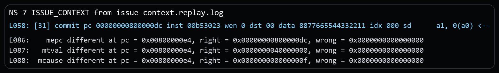
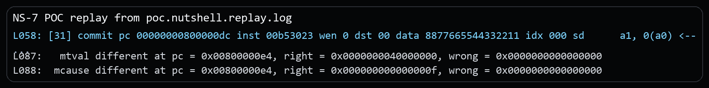
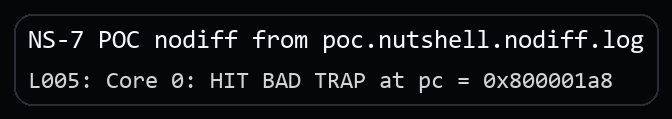

# NutShell Invalid Sv39 `W=1,R=0` Leaf Acceptance Vulnerability Report

## Issue link and affected version

Issue link: `https://github.com/OSCPU/NutShell/issues/266`

This package is based on the official `release-211228` release tag and was confirmed affected at revision `release-211228-142-g041f694` (`041f694965728ea183a0622daa1734002bf4621e`). No local fix revision has been identified yet.

## Candidate title

OSCPU NutShell accepts invalid Sv39 `W=1,R=0` leaf PTEs as writable mappings

## Public issue vs supplementary material

The public issue only states the architectural bug. The security setting, the separate security PoC, and the extra evidence stay in this package.

## Vulnerability type and candidate CWE

**Vulnerability type.** Reserved PTE encoding acceptance leading to unauthorized writable mappings.

**Candidate CWE.** Primary: `CWE-284 Improper Access Control`. Secondary: `CWE-20 Improper Input Validation`.

## Core architectural defect

NutShell accepts a final-level Sv39 leaf PTE with `V=1`, `W=1`, and `R=0`. RISC-V defines `W=1,R=0` as an invalid PTE encoding. A compliant implementation must reject it and raise a page-fault exception corresponding to the original access type.

In the supplied PoC, the final-level PTE has `V/W/A/D=1` and `R=0`, and the test executes a store through that mapping. Spike raises a precise Store/AMO page fault (`mcause=15`), while NutShell commits the store instead of trapping.

## RISC-V specification requirement

During Sv39 virtual-address translation, if `pte.v = 0`, or if `pte.r = 0` and `pte.w = 1`, the implementation must raise a page-fault exception corresponding to the original access type.

Reference: [https://docs.riscv.org/reference/isa/v20260120/priv/supervisor.html#_virtual_address_translation_process](https://docs.riscv.org/reference/isa/v20260120/priv/supervisor.html#_virtual_address_translation_process)

Because the original access in this PoC is a store, the required architectural exception is Store/AMO page fault (`mcause=15`).

## Issue-level architectural reproduction

The minimal rerun binary for this part is the public issue package's `program.elf`. This CVE package keeps the matching replay excerpt and the key instruction sequence below.

### Steps to reproduce

1. Run the public issue package's `program.elf` under difftest.
2. M-mode installs a three-level Sv39 mapping for `MY_VA = 0x40000000`.
3. The final-level PTE is written with `PTE_VWAD`, which sets `V/W/A/D=1` while leaving `R=0`.
4. The test enables Sv39 with S-mode effective privilege and executes the faulting store.

Core source sequence (three-level page-table setup, invalid leaf install, Sv39 enable, and faulting store):

```asm
la   t0, root_pt
la   t1, l1_pt
srli t1, t1, 12
slli t1, t1, 10
ori  t1, t1, PTE_TABLE
sd   t1, (ROOT_INDEX * 8)(t0)

la   t0, l1_pt
la   t1, l0_pt
srli t1, t1, 12
slli t1, t1, 10
ori  t1, t1, PTE_TABLE
sd   t1, (L1_INDEX * 8)(t0)

la   t0, l0_pt
la   t1, bad_data
srli t1, t1, 12
slli t1, t1, 10
ori  t1, t1, PTE_VWAD
sd   t1, (L0_INDEX * 8)(t0)

la   t0, root_pt
srli t0, t0, 12
li   t1, SATP_SV39
or   t0, t0, t1
csrw satp, t0
sfence.vma x0, x0

li   t0, MSTATUS_MPP_MASK
csrc mstatus, t0
li   t0, MSTATUS_MPP_S
csrs mstatus, t0
li   t0, MSTATUS_MPRV
csrs mstatus, t0

li   a0, MY_VA
li   a1, NEW_VALUE
sd   a1, 0(a0)
```

### Expected result

- The store does not complete.
- `mcause = 15` (Store/AMO page fault).
- `mepc = store_site` (`0x800000dc` in this build).
- `mtval = 0x40000000`.
- Memory behind the invalid `W=1,R=0` leaf is not architecturally modified.

### Actual result

NutShell commits the store, while Spike reports the page fault:

```text
[31] commit pc 00000000800000dc ... data 8877665544332211 ... sd      a1, 0(a0) <--
pc: 0x0000000080000130 ... mcause: 0x000000000000000f mepc: 0x00000000800000dc
mtval: 0x0000000040000000 ...
mcause different ... right = 0x000000000000000f, wrong = 0x0000000000000000
```

Excerpt from `poc/issue-context.replay.log`:



## Security relevance

The demonstrated security scenario assumes a deployment where invalid leaf encodings are expected to be architecturally dead and therefore harmless across a trust boundary.

1. A trusted runtime or monitor allows a lower-privileged page-table owner to supply mappings but assumes reserved encodings will fault.
2. The lower-privileged side installs a final-level `W=1,R=0` leaf.
3. A compliant core would reject that encoding and raise a Store/AMO page fault.
4. NutShell accepts the leaf as writable and allows the store to reach the physical target.
5. The attacker gains a write primitive across the page-table validation boundary.

## Security PoC

### Assumptions

A lower-privileged page-table owner is expected to be constrained by architecturally valid leaf encodings, while trusted software assumes invalid `W=1,R=0` leaf encodings will fault.

### PoC setup

The proof of concept uses the invalid `W=1,R=0` leaf as a self-oracle for memory corruption. Instead of stopping at the missing page fault, the program checks whether a physical target changed after the store retired.

### What the PoC shows

- The final-level PTE is deliberately written with `V/W/A/D=1` and `R=0`.
- The program performs a store through that invalid mapping.
- The DUT-only path reads the physical target back and enters the fail block only when the attacker value actually landed in memory.

### Security-effect logs

Replay evidence:

```text
[31] ... data 8877665544332211 ... sd      a1, 0(a0) <--
...
mcause different ... right = 0x000000000000000f, wrong = 0x0000000000000000
```

Excerpt from `poc.nutshell.replay.log`:



DUT-only security effect:

```text
poc/poc.nutshell.nodiff.log:
Core 0: HIT BAD TRAP at pc = 0x800001a8
```

Excerpt from `poc.nutshell.nodiff.log`:



### Expected architectural result

- expected DUT-only bad-trap PC: `0x800001a8`
- resolved region: `fail_write_only_leaf_accepted`
- meaning: the invalid `W=1,R=0` leaf store changed the physical target

### Expected result on NutShell

NutShell retires the store instead of raising `Store/AMO page fault`, and the DUT-only run reaches the post-store corruption fail path.

### Expected result on a compliant core

The store faults with cause `15` and the physical target remains unchanged.

## Evidence files

### Issue-level reproduction

- `poc/issue-context.replay.log`: replay log for the minimal architectural mismatch.
- `poc/image/issue-context-actual.png`: screenshot excerpt from the issue-level replay log.

### Security PoC

- `poc/poc.S`: the security PoC source.
- `poc/poc.elf`: the built PoC binary used in the captured runs.
- `poc/poc.nutshell.replay.log`: replay log for the security PoC.
- `poc/poc.nutshell.nodiff.log`: DUT-only log showing the security effect without difftest.
- `poc/image/poc-replay-evidence.png`: screenshot excerpt from the security-PoC replay log.
- `poc/image/poc-nodiff-effect.png`: screenshot excerpt from the DUT-only security-PoC log.

## Primary CIA impact

- Primary: `Integrity`. The invalid leaf can be used to modify a physical target that trusted software expected to remain unreachable.
- Secondary: `Availability`. If the overwritten target is control state, metadata, or MMIO, the same unauthorized write can crash or hang the system.

## Suggested reporting wording

**Recommended framing.** The strongest supported framing is invalid leaf acceptance that turns a reserved Sv39 encoding into an unauthorized write primitive.

**Suggested description.** OSCPU NutShell, based on the official `release-211228` release tag and confirmed affected at `release-211228-142-g041f694`, may accept an invalid Sv39 leaf PTE with `W=1` and `R=0` as a writable mapping instead of raising a Store/AMO page fault. In deployments where a lower-privileged page-table owner is expected to be constrained by architecturally valid leaf encodings, this can permit unauthorized writes across the page-table validation boundary.

**Suggested supplementary materials.** Include `README.md`, `VULNERABILITY_REPORT.pdf`, `poc/poc.S`, `poc/poc.elf`, the relevant `poc/*.log` evidence, and the screenshots under `poc/image/`.

## Affected version status

Official release tag: `release-211228`. Confirmed affected revision: `release-211228-142-g041f694` (`041f694965728ea183a0622daa1734002bf4621e`). Fixed: none identified yet. Upstream maintainers have been notified through GitHub, and fix coordination is ongoing.

## Fix direction

Leaf permission checks should reject invalid `R=0, W=1` encodings before TLB refill or data access, and no store side effect should be allowed on that path.
