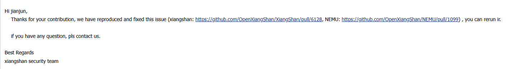
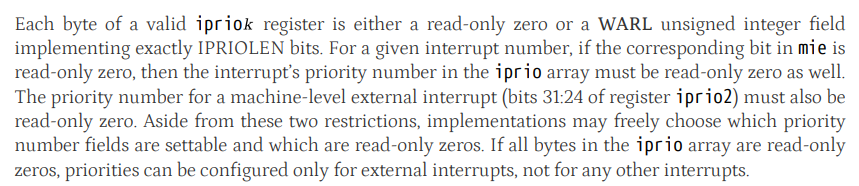
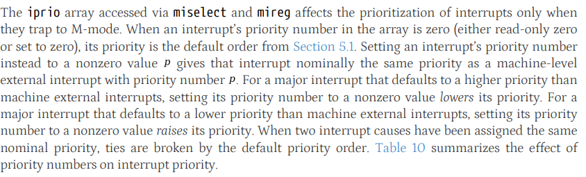
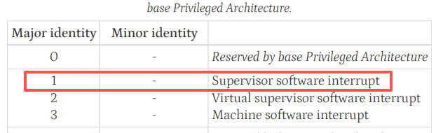
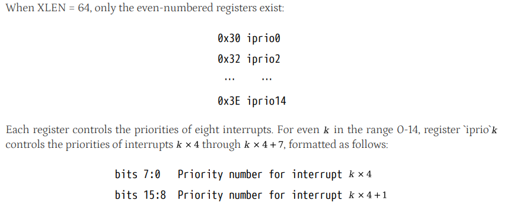

# XiangShan AIA Priority Save/Restore Corruption Report

## Affected version

This package is confirmed on the Kunminghu-v3 development branch. The base
release tag is `v3.2.2-alpha` (`0303f76a84fd705d32f6f0434c63c55e2ff02186`),
while the tested revision is `v3.2.2-alpha-1931-g96c3f568f` at commit
`96c3f568f943a096ffd3d712dc6f462ac4b1ba33`.

The XiangShan security team confirmed reproduction and provided public fix
PRs for review:

- XiangShan: https://github.com/OpenXiangShan/XiangShan/pull/6128
- NEMU reference update: https://github.com/OpenXiangShan/NEMU/pull/1099



## Vulnerability type

Interrupt-controller configuration integrity violation.

## Summary

Trusted firmware or monitor code temporarily masks interrupt delivery, saves
host-owned AIA priority state, later restores that state, and then trusts the
restored priority policy for future host interrupt ordering.

Correct behavior is that the already-configured priority remains architecturally
visible while delivery is masked. The validated XiangShan PoC instead captures
a false zero during the save and writes that false zero back during restore,
persistently degrading host-owned interrupt-priority state.

## Execution evidence

- `poc.xiangshan.nodiff.log` is the decisive witness. It reaches
  `HIT GOOD TRAP at pc = 0x800000ec`, the `bug_persistent_priority_loss` path.
- `poc.objdump.txt` maps the save / restore / witness path through
  `miselect` / `mireg` and the terminating bug exit.
- `poc.xiangshan.replay.log` documents the current integrated reference limit
  on AIA indirect CSR accesses and should be treated as supporting context, not
  the primary evidence.

## Specification basis

The relevant AIA rule is that an implemented priority byte remains a real piece
of architectural state even when delivery is temporarily masked. The delivery
mask may suppress interrupt handling, but it must not erase the stored priority
value from CSR readback.









## Core issue

The tested XiangShan AIA indirect CSR path masks machine-level or supervisor-
level `iprio` readback by the current value of the matching `mie` or `sie`
enable bit. A priority byte should read as zero only when the corresponding
interrupt source is architecturally unimplemented, not merely because software
temporarily disables delivery.

The assembly proof of concept demonstrates the concrete consequence:

```text
configure PrioSSI = 0x01
-> clear mie.SSIE during a trusted critical section
-> save selected iprio window through miselect/mireg
-> XiangShan returns a false zero
-> restore exactly what was saved
-> re-enable mie.SSIE
-> PrioSSI stays 0x00 instead of returning to 0x01
```

The bug is not limited to transient CSR visibility. The incorrect readback is
captured by trusted software and then written back as durable host
interrupt-priority state.

## Trusted-software preconditions

The standalone assembly PoC uses M-mode only because the affected state is
machine-owned interrupt-priority configuration. The security meaning is about
trusted monitor / firmware behavior, not about granting the attacker machine
CSR access.

The environment side provides:

1. AIA indirect CSR support for selecting and reading machine interrupt
   priorities
2. a host-owned nonzero priority that matters after the boundary, such as an
   interrupt used for monitor service ordering, preemption, or time-sensitive
   response
3. trusted code that temporarily disables delivery and saves/restores the AIA
   priority window through the architectural CSR interface

## Lower-privileged initiator model

The lower-privileged actor in this package does not directly write AIA CSRs.

The lower-privileged role is narrower and realistic:

1. a guest, supervisor payload, or service caller can repeatedly induce an
   ordinary privileged boundary
2. that boundary causes trusted firmware / monitor code to run its legal AIA
   save/restore sequence
3. the hardware bug lives inside that trusted sequence and corrupts host state

The current evidence supports this induced-boundary model rather than direct
lower-privileged writes to AIA CSRs.

## Observed effect

What should happen:

```text
host configures PrioSSI = 0x01
-> host temporarily clears mie.SSIE
-> host saves iprio window and still sees PrioSSI = 0x01
-> host restores saved value
-> host re-enables mie.SSIE
-> PrioSSI remains 0x01
```

What the vulnerable DUT does:

```text
host configures PrioSSI = 0x01
-> host temporarily clears mie.SSIE
-> host saves iprio window and reads a false PrioSSI = 0x00
-> host restores that false zero
-> host re-enables mie.SSIE
-> PrioSSI is now persistently 0x00
```

The durable effect is host interrupt-priority downgrade, not merely a one-shot
CSR readback discrepancy.

## Primary CIA impact

- Primary: `Integrity`. Trusted host-owned interrupt-priority configuration can
  be persistently corrupted by a legal save/restore flow.
- Secondary: `Availability`. If the affected priority is security-relevant,
  response ordering, preemption behavior, or latency guarantees may degrade
  after the corrupted restore.

The supported impact is persistent corruption of host interrupt-policy state
through trusted software's ordinary lifecycle code. The current PoC does not
show direct privilege escalation.

## PoC evidence

- `poc/poc.S` turns the underlying AIA readback behavior into a trusted
  save/restore corruption scenario.
- `poc/poc.xiangshan.nodiff.log` is the decisive end-to-end witness. It reaches
  `HIT GOOD TRAP at pc = 0x800000ec`, which corresponds to the `EXIT 31`
  `bug_persistent_priority_loss` path.
- `poc/poc.objdump.txt` maps:
  - `0x80000024` to `csrw miselect, t1`
  - `0x8000002c` / `0x80000050` / `0x8000006c` to the `mireg` write/save/check
    sequence
  - `0x800000d0` to `bug_persistent_priority_loss`
  - `0x800000ec` to the terminating bug-path trap instruction
- `poc/poc.xiangshan.replay.log` documents the current integrated reference
  limitation rather than the security consequence itself. The current diff
  reference aborts at the first AIA indirect CSR path with:
  - `mepc different ... right = 0x0000000080000024, wrong = 0x0000000000000000`
  - `mtval different ... right = 0x0000000035031073, wrong = 0x0000000000000000`
  - `mcause different ... right = 0x0000000000000002, wrong = 0x0000000000000000`
- `poc/realistic_aia_save_restore_sketch.c` shows the same high-level trusted
  software pattern in monitor / firmware terms: host AIA state save, false-zero
  capture while delivery is disabled, trusted restore, and later priority-
  integrity check.

## Real software path mapping

The source-level comparison below was checked against Linux upstream commit
`8b69c047587112f7bcb4b0d83f2729d8dd29ebe2` and QEMU upstream commit
`20553466cc47af6a8c95f665b601fce3c852e503` on 2026-06-28. These references
show that real hypervisor and emulator paths save, restore, and read/modify/
write AIA priority state of the same class modeled by the PoC.

Real hypervisor and emulator paths save, restore, and read/modify/write the
same AIA priority state class modeled by this PoC:

- Linux KVM/RISC-V saves and restores AIA priority CSRs such as `HVIPRIO1` and
  `HVIPRIO2` across vCPU load / put:
  [arch/riscv/kvm/aia.c#L121-L140](https://github.com/torvalds/linux/blob/8b69c047587112f7bcb4b0d83f2729d8dd29ebe2/arch/riscv/kvm/aia.c#L121-L140),
  [arch/riscv/kvm/aia.c#L159-L178](https://github.com/torvalds/linux/blob/8b69c047587112f7bcb4b0d83f2729d8dd29ebe2/arch/riscv/kvm/aia.c#L159-L178)
- Linux KVM also emulates AIA priority register read / modify / write paths by
  reading priority bytes and writing them back to the architectural CSRs:
  [arch/riscv/kvm/aia.c#L264-L294](https://github.com/torvalds/linux/blob/8b69c047587112f7bcb4b0d83f2729d8dd29ebe2/arch/riscv/kvm/aia.c#L264-L294),
  [arch/riscv/kvm/aia.c#L297-L345](https://github.com/torvalds/linux/blob/8b69c047587112f7bcb4b0d83f2729d8dd29ebe2/arch/riscv/kvm/aia.c#L297-L345)
- QEMU models AIA indirect priority registers as byte arrays and exposes
  read / modify / write logic through `rmw_iprio()`:
  [target/riscv/csr.c#L2491-L2547](https://github.com/qemu/qemu/blob/20553466cc47af6a8c95f665b601fce3c852e503/target/riscv/csr.c#L2491-L2547),
  [target/riscv/csr.c#L2717-L2722](https://github.com/qemu/qemu/blob/20553466cc47af6a8c95f665b601fce3c852e503/target/riscv/csr.c#L2717-L2722)

`poc/poc.S` models trusted firmware that temporarily clears `mie.SSIE`, saves
`iprio0` through `miselect`/`mireg`, restores the saved value, and then observes
persistent priority loss. The key affected handler class is save/restore or
RMW code that trusts architectural readback as durable priority state.

Real KVM and emulator code maintain AIA priority state across lifecycle
transitions and RMW interfaces. This finding is therefore best framed as persistent
host interrupt-priority state corruption caused by false-zero readback during a
legal trusted sequence.

## Scope

This package is limited to:

- it is about AIA `iprio` readback semantics during trusted save/restore
- it is about persistent host-owned priority downgrade after a legal restore
- it is about lower-privileged code inducing the privileged boundary, not
  directly modifying the CSR state itself

Systems where unprivileged software cannot induce the relevant trusted
save/restore boundary, and production guest ABI exploitation beyond this PoC,
are outside this report.

## CWE mapping

Primary: `CWE-664 Improper Control of a Resource Through its Lifetime`.
Secondary: `CWE-682 Incorrect Calculation`.

## Fix direction

XiangShan should make AIA `iprio` readback reflect the implemented priority
storage independent of the current runtime interrupt-enable value.
Read-only-zero treatment should be tied to architectural implementation of the
underlying source, not to software's temporary delivery mask.
